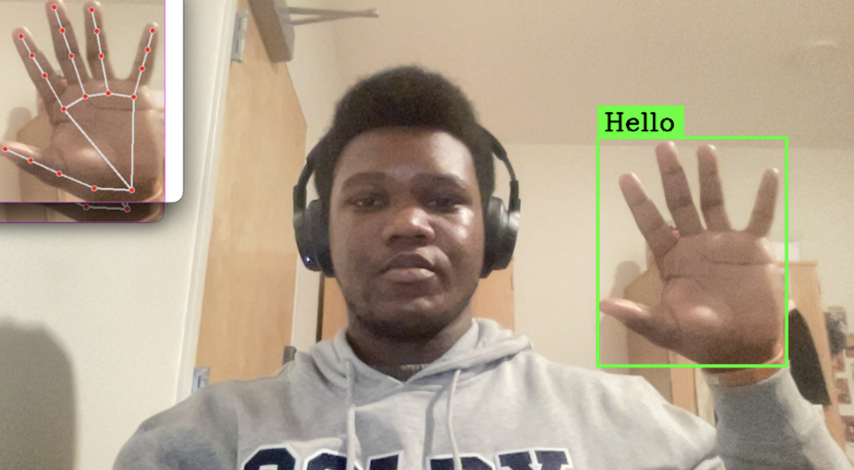

# Sign Language Recognition

A real-time sign language recognition system built with Python, OpenCV, MediaPipe, TensorFlow, and cvzone.  
The project enables gesture-based communication by detecting and classifying hand signs captured through a webcam.

---

## Overview

This repository includes tools for:
- Capturing and preprocessing hand gesture images  
- Training and deploying a gesture classification model  
- Running real-time inference using a Keras model optimized for Apple Silicon  

The model recognizes a predefined set of gestures such as “Hello,” “Yes,” and “Thank you.”

---

## Repository Structure

Sign_Language/
│
├── data_collection.py # Script for capturing and saving gesture images
├── test.py # Real-time classification and visualization
├── converted_keras/
│ ├── keras_model.h5 # Pre-trained model
│ └── labels.txt # Class labels for prediction
├── assets/
│ └── thumbnail.jpg # Project thumbnail
├── README.md
└── .gitignore

python3.11 -m venv .venv
source .venv/bin/activate

